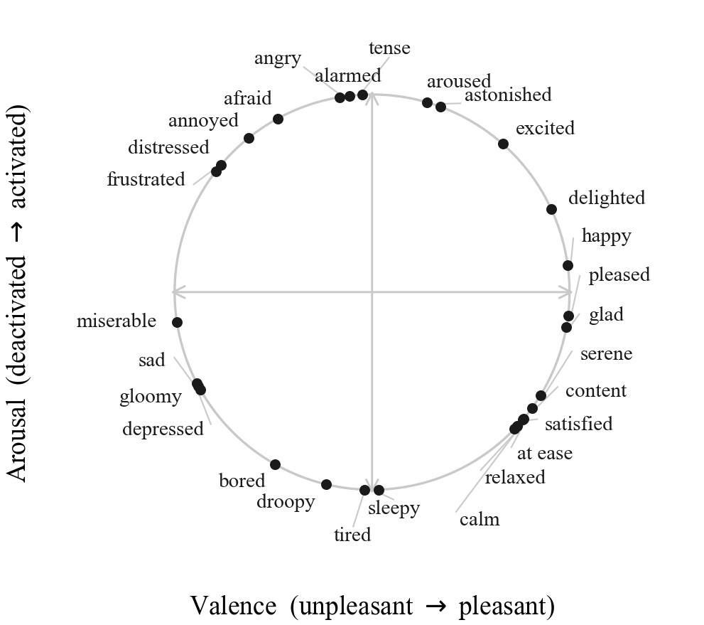
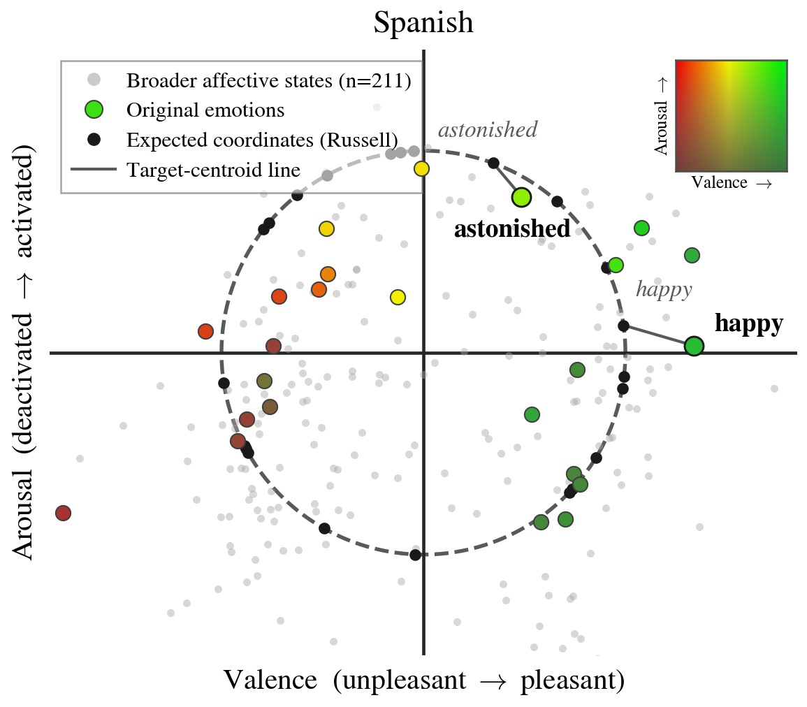
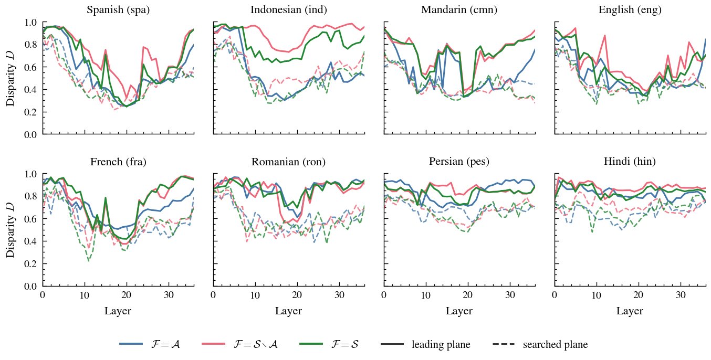
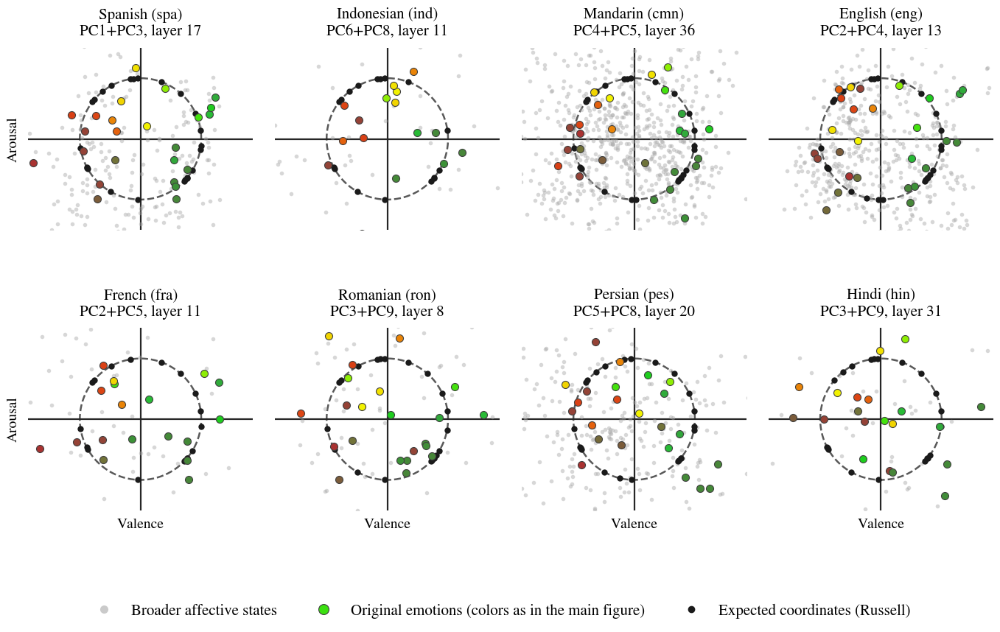

# The Emotion Circumplex in a Multilingual LLM's Activation Space

This repository was built as part of **Mosaic-Emo**, a multilingual affective
state benchmark currently under anonymous review. It serves two purposes: the
**data collection** pipeline that built the Romanian side of the benchmark
(documented separately in [`pipeline/README.md`](pipeline/README.md)), and the
paper's **interpretability experiments**
([`pipeline/affect_geometry/`](pipeline/affect_geometry/)). This README
focuses on the latter — it summarizes the accompanying blog post,
[*The Emotion Circumplex in a Multilingual LLM's Activation
Space*](https://alexjerpelea.com/circumplex.html): how a multilingual LLM
represents fine-grained affective states in its activation space.

## The benchmark in one minute

Two definitions first. An **emotion**, in the sense used by emotion detection
datasets, is one of a small, predetermined label set — the Ekman or Plutchik
basic emotions (*happy*, *sad*, *angry*, ...). An **affective state** is any
term people use to describe their felt experiences, including figurative
expressions of feeling. It is the open-vocabulary superset of emotion: it
covers nuanced experiences that aren't well approximated by compositions of
basic emotions (*grief*), states that are felt but aren't quite emotions
(*tired*, *conflicted*), and language-specific terms with no clean translation
(Romanian *dor*). And where emotion datasets are labeled by third-party
annotators, an affective state benchmark can use the author's own words for
their own state.

That is what Mosaic-Emo is: a native-speaker-informed benchmark of personal
narratives in which authors explicitly label their own affective state ("I
feel X"), spanning eight typologically, syntactically, and geographically
diverse languages — English, Spanish, French, Romanian, Persian, Hindi,
Mandarin, and Indonesian — and an unbounded set of emotion labels drawn from
diverse written sources. This repo built the Romanian side. The task: the
affective state terms are masked, and a model must predict the original terms
used by the author. The extrinsic analysis benchmarks models on this task; its
two headline results are that multilingual Qwen outperforms language-specific
models tailored to each language, and that finetuning on any single language
improves affective-state identification in all the others. The rest of this
README is the intrinsic analysis.

## Setup: looking for the circumplex

### Russell's circumplex

We ground the analysis in Russell's (1980) **circumplex theory of affect**,
which arranges emotions on a circle in the two-dimensional plane governed by
**valence** (pleasant ↔ unpleasant) and **arousal** (activated ↔ deactivated).
Its standard formulation places 28 common emotion words on this circle:

> Russell's (1980) circumplex: the 28 reference emotion words placed on a
> circle whose horizontal axis is valence and vertical axis is arousal.

This geometry is known to emerge in LLM activations — but for closed sets of
standard emotions, like the original 28. The affective states in Mosaic-Emo
are far broader and more open-ended. So we ask two questions: whether the
broader affective states are explained by the same valence–arousal geometry,
and whether that geometry is shared between languages.

### Affective state representations

We represent each affective state as a point in model activation space. We run
Qwen3-8B in bfloat16 and record hidden states after the embedding layer and
after each of the 36 transformer blocks, giving 37 layers with hidden size
4096. Each occurrence of an affective state is processed in its original
document context, with the state no longer masked; the hidden vectors at the
state's tokens are mean-pooled into one vector per occurrence, and averaging
over all of a state's occurrences yields a single centroid **x**ₛ ∈ ℝ⁴⁰⁹⁶ at
every layer. We only keep states with at least 30 occurrences.

Three sets to keep track of below. **𝒮** is a language's full set of affective
state centroids. **𝒜 ⊂ 𝒮** are the **original emotions**: for each of
Russell's 28 words, we search the language's affective states for clear,
direct synonyms (Romanian *fericit* → *happy*), with LLM help and inspection
by native or proficient speakers; metaphorical or context-dependent
near-synonyms stay unmatched. The matched states are effectively the
language's translations of Russell's words. Everything else, **𝒮 ∖ 𝒜**, are
the **broader affective states**. Coverage runs from 17 (Indonesian) to 27
(English) of the 28 words, and vocabularies range from 69 (Indonesian) to 761
(Mandarin) states.

### Finding candidate planes

If the circumplex is present in the activations, it lives on some
two-dimensional plane through the centroid cloud. To generate candidates, we
standardize the centroids and fit PCA on a subset we call the **fit set
ℱ ⊆ 𝒮** — the choice of fit set is the interesting knob, because fitting on
the broader states alone asks whether they carry the structure by themselves.
For each fit set, we look at planes in two ways: (1) the **leading plane**
PC1+PC2, where the circumplex would saliently appear only if it is the
strongest structure in the fit set, and (2) a **search** across pairs of
leading components (each pair of the top 10 PCs gives a plane) and across
layers for the best-fitting plane, which can reveal a circumplex that is
present but not the dominant variance structure.

### Scoring alignment

To measure how well a candidate plane captures affect, we compare it against
Russell's circle. We project the original emotions' centroids onto the plane
and measure how far each lands from the coordinates Russell assigns its word.
Alignment is measured on the original emotions alone, since the broader
affective states have no prescribed position — where they land is what we
want to discover. Formally, we use the Procrustes disparity **D**: the error
left after each word's projection is optimally scaled, rotated, and translated
onto its circle position. We report the fraction of chance-level disparity an
alignment eliminates, **PRE = 1 − D/D_null**: 0 = chance, 1 = perfect
circumplex. Significance uses the PROTEST permutation test (5,000 shuffles),
and when a reported alignment benefits from a search over planes or layers,
the null replays the identical search — so cherry-picking the best plane
can't manufacture significance.

## The circumplex is the leading geometry of broader affective states

Prior work on closed emotion sets already finds dominant circumplex
geometries, so it is no surprise that setting ℱ = 𝒜 (fitting the axes on the
original emotions themselves) gives a leading plane PC1+PC2 aligned with
Russell's circle in most languages. We question whether the same holds for our
broader affective states, so we fit the axes on them alone, removing every
standard emotion from the fit set (ℱ = 𝒮 ∖ 𝒜). Using PC1+PC2, the alignment
barely changes (English 0.64 → 0.60, Spanish 0.73 → 0.67; Indonesian is the
only exception) and even improves for French and Romanian. This suggests that
the model organizes even its broader affective vocabulary primarily along
valence and arousal, rather than reserving that structure for the standard
emotions. The finding is not simply that such a plane *exists* for the broader
states — it is that the plane is *dominant*: it sits on the first two
principal components of the broader states' own variance.

> Spanish centroids on the leading plane (layer 20, ℱ = 𝒮),
> Procrustes-aligned to Russell's circumplex. Green: the original emotions;
> black: where Russell's coordinates expect them; gray: the 211 broader
> affective states, whose positions are free.

| Lang | *ℱ = 𝒜* | *ℱ = 𝒮 ∖ 𝒜* | *ℱ = 𝒮* |
|------|--------:|------------:|--------:|
| spa | 0.73 | 0.67 | 0.74 |
| ind | 0.67 | 0.20† | 0.30 |
| cmn | 0.65 | 0.59 | 0.65 |
| eng | 0.64 | 0.60 | 0.64 |
| fra | 0.45 | 0.59 | 0.54 |
| ron | 0.34 | 0.39 | 0.25 |
| pes | 0.25 | 0.20 | 0.23 |
| hin | 0.20† | 0.18† | 0.17† |

> PRE of the leading plane PC1+PC2 per fit set, at each language's best layer.
> Higher is better. All values are significant under the corrected permutation
> test except those marked †.

## The circumplex is present but entangled

Where the leading-plane alignment is weak (Romanian, Persian, Hindi, and, for
the broader fit sets, Indonesian), the circumplex does not vanish: a search
over component pairs and layers recovers it on non-leading components (in
ℱ = 𝒮, Romanian 0.25 → 0.60 and Persian 0.23 → 0.49). The circumplex is
present in these languages, but entangled with stronger variation factors.

> Procrustes disparity D across layers for every language and fit set (lower
> is better). Solid lines: the leading plane PC1+PC2; dashed lines: the best
> searched pair of the top 10 components at that layer.

The layer sweep separates the languages into two regimes cleanly: for the
stronger ones the leading-plane and searched curves dip together, while for
Romanian, Persian, and Hindi the leading plane stays near chance and only the
searched planes dip. Alignment is strongest in the middle of the network in
every language. And the searched planes show that the broader states really do
carry the structure on their own: fitting only on ℱ = 𝒮 ∖ 𝒜, with the
original emotions held out of the standardization and the PCA entirely, the
circumplex reappears from the broader states' variance alone in every language
except Hindi:

> Best searched plane with ℱ = 𝒮 ∖ 𝒜 (original emotions held out of the
> standardization and the PCA) for all eight languages.

## The circumplex transfers across languages

Multilingual transformers process meaning language-agnostically in their
middle layers; if affect is part of that shared substrate, one language's
circumplex plane should work for another. We test whether one language's 28
original emotions trace Russell's circle on the circumplex plane of another.
For an ordered pair L_A → L_B, we take the plane and layer that win L_A's own
search with ℱ = 𝒮 and freeze both before any target is seen. L_B's centroids
are then recentered by their own mean, standardized with L_A's per-dimension
scales, and projected onto the frozen plane; L_B's alignment is measured on
its original emotions as before.

Every language's plane recovers every other language's circumplex in a
statistically significant way (all 56 ordered pairs, p ≤ 0.008), supporting a
shared, largely language-agnostic affective subspace. Interestingly,
language-matched planes are rarely the best: a mismatched plane wins for six
of eight targets, and the winner is almost always Mandarin — its plane
recovers Romanian's standard emotions at PRE = 0.71 against the matched 0.60.

| Plane from *L_A* | eng | spa | cmn | ind | ron | pes | hin | fra |
|------------------|----:|----:|----:|----:|----:|----:|----:|----:|
| eng | *0.72* | 0.69 | 0.61 | 0.67 | 0.63 | 0.60 | **0.57** | 0.72 |
| spa | 0.70 | *0.74* | 0.60 | 0.51 | 0.61 | 0.54 | 0.43 | 0.62 |
| cmn | **0.80** | **0.80** | ***0.68*** | **0.75** | **0.71** | **0.65** | 0.56 | 0.71 |
| ind | 0.69 | 0.73 | 0.64 | *0.70* | 0.64 | 0.56 | 0.48 | 0.71 |
| ron | 0.72 | 0.61 | 0.56 | 0.57 | *0.60* | 0.31 | 0.20 | 0.58 |
| pes | 0.66 | 0.71 | 0.59 | 0.52 | 0.64 | *0.49* | **0.57** | 0.62 |
| hin | 0.65 | 0.50 | 0.54 | 0.41 | 0.44 | 0.36 | *0.48* | 0.48 |
| fra | 0.52 | 0.50 | 0.42 | 0.51 | 0.61 | 0.39 | 0.38 | ***0.76*** |

> Cross-lingual transfer: PRE of the target language's standard emotions on
> the plane fit and frozen on L_A. Bold = best source per target, italics =
> language-matched.

We can only speculate on why Mandarin is the best source: it is both our
largest vocabulary (761 states) and among the model's best-resourced
languages. If one language's states are a noisy estimate of a shared affect
space, as the transfers suggest, then the languages whose data covers that
space most should estimate its axes best. Notably, Indonesian, despite being
one of the least resourced languages in the benchmark and having its smallest
affective vocabulary (69 states), is among the strongest sources.

## The shape of the broader states

One more observation, which we offer as a hypothesis rather than a conclusion.
In the Spanish plane above, the broader states do not sit on the circle, even
though the plane that arranges the original emotions into it is computed
largely from their own variance. A state outside the circle cannot be an
average of the original emotions, yet its angle still tracks meaning: on
English's best ℱ = 𝒮 plane, *guilty* and *ashamed* (174–178°) lie between
*miserable* (149°) and *depressed* (199°), but at 1.8–2.5 times the circle's
radius. A reading consistent with this is that the broader states obey the
circumplex's angular valence–arousal structure while gaining an extra degree
of freedom in magnitude; what that magnitude tracks (intensity, specificity,
or something else) we leave to future work.

## Where things live in this repo

- [`pipeline/affect_geometry/`](pipeline/affect_geometry/) — all the code
  above: manifest building (`prepare_final_data.py`), hidden-state extraction
  (`extract.py`), the fit-set analyses (`analyze_russell.py`,
  `analyze_all_states.py`, `analyze_broader_only.py`), cross-language
  transfer (`transfer_*.py`), and the figure scripts (`plot_*.py`).
  `run_final_suite.sh` runs the full suite for one extraction variant;
  numerical results and figures are committed under `results/` and
  `figures/`, and the experiment log is in `RESULTS_FINAL_DATA.md` (with
  earlier iterations in `RESULTS.md`, `RESULTS_RUSSELL.md`, and
  `RESULTS_MODEL_COMPARISON.md`).
- [`pipeline/README.md`](pipeline/README.md) — the Romanian data-collection
  pipeline: seed lexicon, corpus collection, pattern extraction, LLM
  validation, human evaluation, benchmark construction, and the zero-shot /
  fine-tuning evaluations.

Mosaic-Emo is joint work, currently under anonymous review, so the paper is
not linked here yet. This README covers only the intrinsic analysis (Section 5
and its appendix); the benchmark construction, the data collection across the
eight languages, the native-speaker validation, and the extrinsic experiments
are the bulk of the paper.
